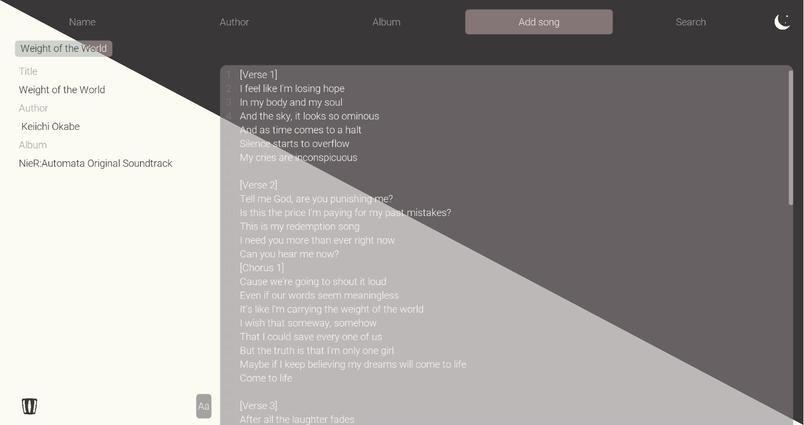

 
# calliri
Local lyrics manager

# Features
- Add lyrics with attached song, author and album name
- Change the UI font size
- Change the theme (light/dark)
- Auto-save when a change occures

# To do
- Search song
- When adding a tab, making it active by default
- Improve icon quality and theme adaptation

# Credit
Made with [Godot Engine](https://godotengine.org/)

Theme [Marble](https://github.com/hundredrabbits/Themes) by Hundred Rabbits

Font [Roboto](https://fonts.google.com/specimen/Roboto) designed by Christian Robertson

